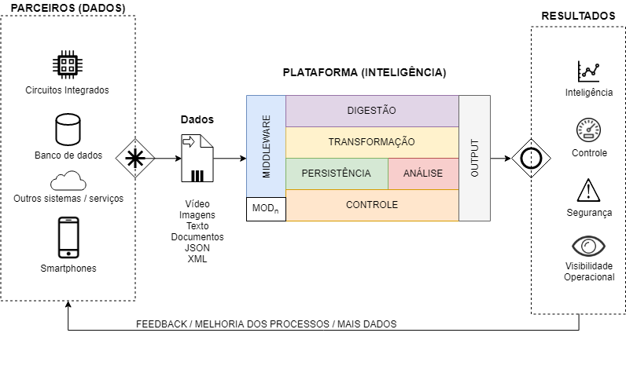
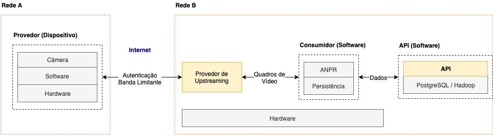
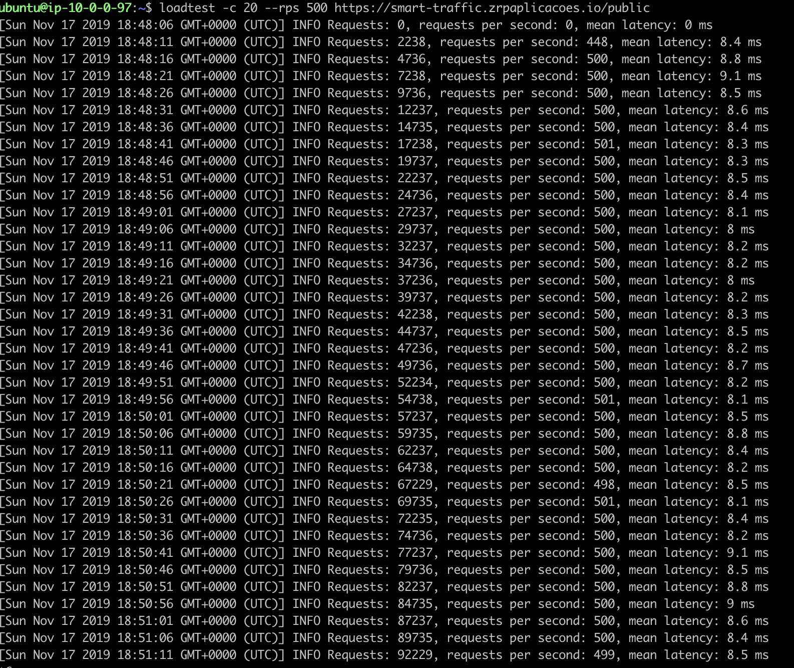

# Smart Traffic - Plataforma para Tracking de Veículos em Cidades Inteligentes

## Proposta

O projeto consiste na implementação de uma API comercializável, com suporte a vídeo e a dados estruturados, responsável por analisar, persistir e disponibilizar a geolocalização mais recente, bem como o percurso diário de um grupo de veículos, o que permite o monitoramento da infraestrutura urbana, conectando os cidadãos, o estado e a iniciativa privada em um único lugar. Ao conectar distintas fontes de dados e interconectar as informações geradas pelos diversos agentes do sistema, introduz-se as características chave presentes no cenário da indústria 4.0: extensibilidade, interoperabilidade e interconexão dos dispositivos e de seus agentes, afim de se automatizar decisões estratégicas pelas organizações públicas. Este projeto, portanto, focou em duas grandes áreas da computação no que tange cidades inteligentes, big data e IoT. Para a implementação, utilizou-se PostgreSQL, Hadoop, Apache Hive e serverless computing. Adicionalmente, utilizou-se como provedor de infraestrutura a AWS, que proveu o suporte necessário à implementação de uma solução robusta de IoT encima da infraestrutura de câmeras LPR (License Plate Recogntion) já existentes no mercado.

## Arquitetura

A especificação da arquitetura do projeto foi feita com base no princípio dos 5V's (volume, velocidade, variedade, variabilidade e valor). Cada um desses fatores é crucial na implantação da arquitetura, o que permitiu a construção de uma arquitetura mínima viável que é extensível e cujo processamento é NRT (Near Real Time).

<p align="center">
  
</p>

## Implementação e Resultados

A implementação do projeto foi dividida em cinco etapas, sendo três etapas associadas ao processo ETL (Extract Transform Load), uma etapa relacionada à adequação das câmeras LPR ao processo ETL, o que consistiu na implementação da componente de IoT, e a última etapa responsável pela construção de uma API responsável por disponibilizar os dados estruturados para o cliente final.

### 1. Extração (Extract)

Para realizar a extração de dados criou-se uma função pura em NodeJs que executa um dump do banco de dados relacional que contém informações de veículos e de geolocalização do dia anterior e passa a informação via stream para a próxima etapa.

### 2. Transformação (Transform)

Para realizar a transformação de dados criou-se uma função pura em NodeJs que manipula o stream recebido para traduzir em dois futuros streams, um para salvar dentro de uma estrutura de veículos no Data Warehouse e outro para salvar dentro de uma estrutura de geolocalizações.

### 3. Carregamento (Load)

Com ambos os streams prontos, criou-se uma outra função pura em NodeJs que recebe ambos os streams, salva em localidades conhecidas para veículos e para geolocalizações e dispara uma etapa do cluster do EMR, que utiliza-se do Hadoop e um script Hive para reorganizar os dados em tabelas particionadas.

### 4. IoT

Foram extraídas amostras de câmeras LPR comerciais, que compõe a componente de vídeo, e simulou-se tanto para interfaces USB, quanto para câmeras via IP, através do protocolo RTSP, um stream de vídeo, utilizando-se o framework GStreamer. Para os dispositivos, utilizou-se o protocolo TLS, com autenticação do lado do cliente e certificados X.509 emitidos pela CA, no caso o serviço AWS IoT Core, para a autenticação apenas dos dispositivos autorizados por nós. Adicionalmente, graças ao formato de container de vídeo MKV, adicionou-se metadados de latitude e longitude que foram incorporados na análise realizada quadro a quadro, de onde extrairam-se as placas dos veículos visíveis em cada quadro, injetando os resultados na etapa de extração. A figura abaixo mostra a conexão estabelecida entre o dispositivo e a infraestrutura já existente.

<p align="center">
  
</p>

#### 5. API

Por fim foi desenvolvida uma API que permite a ingestão e o acesso aos dados já estruturados. Para o consumo dessa API, elaborou-se um software web responsável pelo cadastro dos clientes e visualização dos dados em um mapa. Para o cálculo das rotas, utilizou-se a API do Google Maps. Para a inserção dos dados, o seguinte formato foi utilizado.

```json
{
  "geolocation": {
    "license_plate": "TGG-2321",
    "lat": 23.123123,
    "lng": 21.123123
  }
}
```

A figura abaixo mostra um teste de carga realizado na API utilizando-se o software loadtest.

<p align="center">
  
</p>

## Grupo

- Pedro Paulo Azevedo Gryzinsky Grillo
- Rafael Trostli Costella

## Orientador

Prof. Dr. Jorge Luis Risco Becerra
